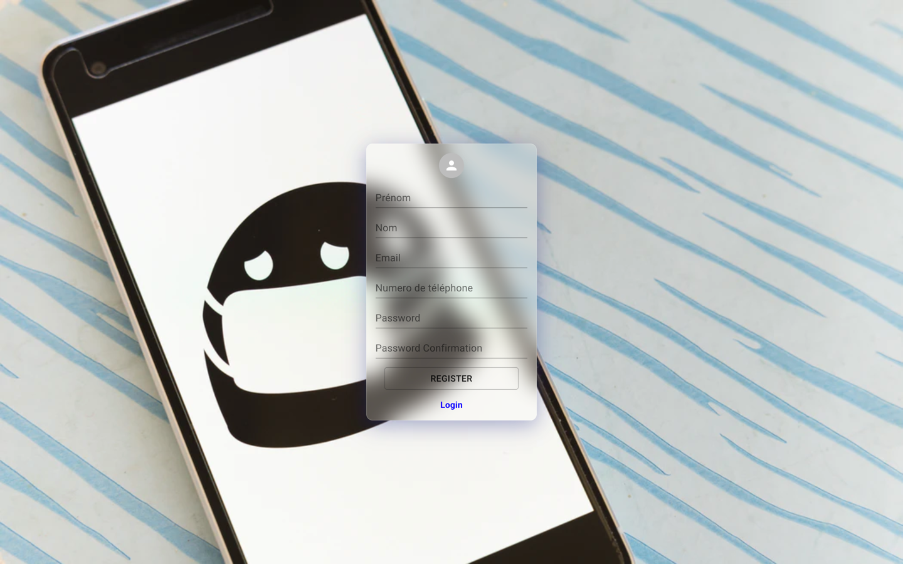
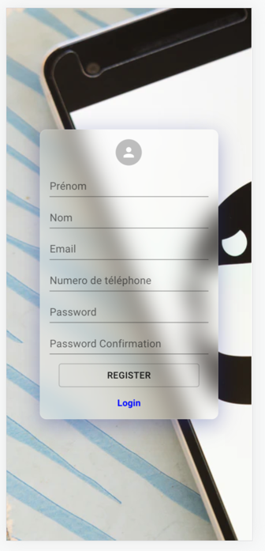
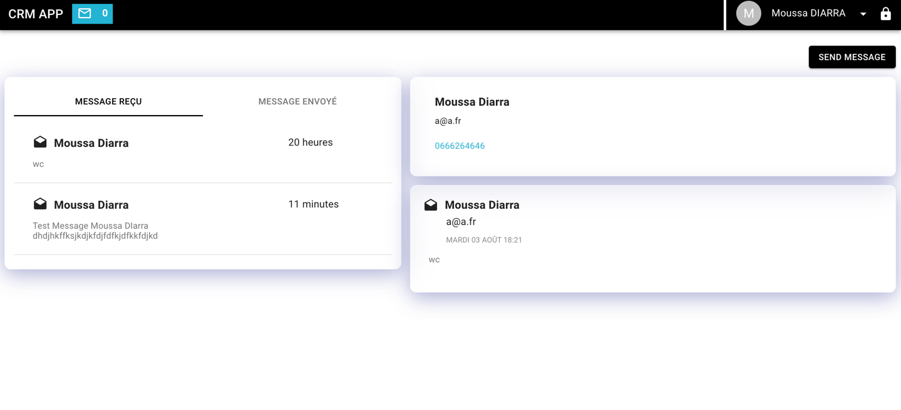
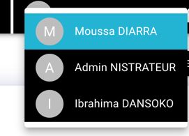
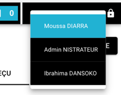
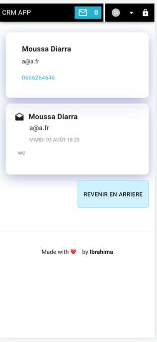
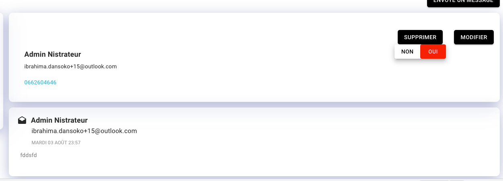
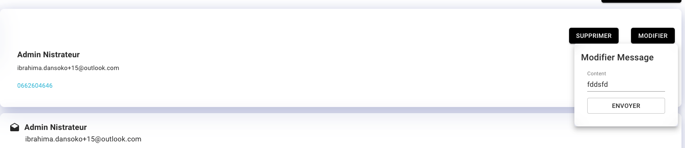

# CRM APP
    Basic App for messaging 

## Authors & Contributors

| Name | Role | GITHUB|
|------|------|------|
| Ibrahima Dansoko | **Front/Back** | @ibrahimdans|

# Architectures

```
Mono Repo with Lerna 
api => NestJS [TypeScript] with Postgres  [BDD]
app => Nest.JS with Redux for store 🔥  [UI]
```
# Start Projet & Script
```shell script
⚠️ Create BDD Postgres with name => "CrmApp" or launch docker
$ yarn 
$ cp packages/api/.env.sample packages/api/.env
$ yarn bootstrap
$ echo launch docker for bdd 
$ cd ../api/docker ; docker-compose up 
$ yarn dev-api
$ yarn dev-app
```
### Links
1) Login

-- [Version Mobile]

2) Register

-- [Version Mobile]

3) Home Message

-- [Version Mobile]

4) Switch User

-- [Version Mobile]

5) Go To Message (only mobile)

6) Suprimer Message

7) Modifier Message


# DEMO
<p>
  
</p>
